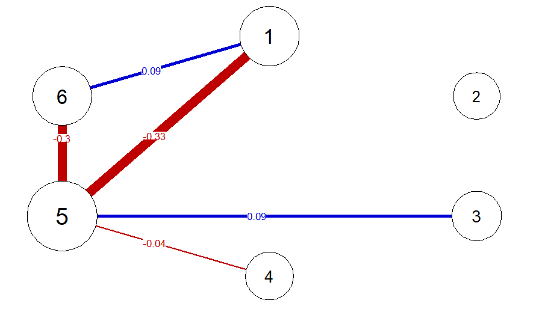

---
output:
  html_document: default
---

# SEset
An `R` package implementing the **SE-set algorithm**, a tool to explore statistically-equivalent path models from correlation matrices and Gaussian Graphical Models (GGMs).

## Background
This repository contains an `R` package used by Ryan, Bringmann and Schuurman (pre-print)[[PsyArXiv]](https://psyarxiv.com/ryg69/) to aid researchers in 
investigating the relationship between a given GGM estimate (in the form of a precision matrix) and possible underlying linear path models. Linear path models can also be interpreted as "weighted DAGs". Full details on the package can be found in **Appendix B** of the manuscript, and code to reproduce the empirical illustration in that paper can be found in [this repository](https://github.com/ryanoisin/CausalHypotheses).

Please note that we recommend the use of this tool only for GGMs with **13 or less nodes** as the size of the outputted object, and the run-time, grows factorially ($p!$) with each node in the network.

## Installation
The current version of this package can be installed directly from github using
```r
devtools::install_github("ryanoisin/SEset")
```

## Usage
The main SE-set function takes a precision matrix as input by default (but can also take a matrix of partial correlations, or a covariance matrix, detailed below). This can be estimated using packages such as `qgraph`, using either raw data or a matrix of correlations. For example, using the `riskcor` correlation matrix supplied with the package as input, the precision matrix `omega` can be estimated by running
```r
# load data
data(riskcor)

# estimate precision matrix
estimate <- qgraph::EBICglasso(riskcor, n = 69, returnAllResults = TRUE)
omega <- estimate$optwi

# The precision matrix can also be standardized to a partial correlation matrix, and plotted as a network
library(qgraph)
parcor <- qgraph::wi2net(omega)
pnet <- qgraph(parcor, repulsion = .8,vsize = c(10,15), theme = "colorblind", fade = F, edge.labels = TRUE)
```



Given a $p$-variate precision matrix, the `SEset` package can be used to obtain a set of maximally $p!$ statistically equivalent weighted DAGs (i.e., linear path models): One DAG for every possible topological ordering of the $p$ variables, from exogenous to endogenous. This is the SE-set of `omega` which gives the package its name.

The statistically-equivalent set is found by using the `network_to_SEset` function

```r
SE_example <- network_to_SEset(omega, digits = 2, rm_duplicates = TRUE)

```
where the `digits` arguments determines the rounding of parameters in the weighted DAGs, and the `rm_duplicates` argument indicates that only unique weighted DAGs should be returned: duplicates are removed after rounding. Typically, when duplicates are removed, the number of unique DAGs returned is much less than $p!$.


### Exploring the SE-set

Individual members of the SE-set can be plotted, for example using qgraph. When visualizing, remember that the weights matrix of the path model $B$ is given in SEM form $X = BX +e$, and so should be read "from column to row", that is $b_{ij}$ encodes the direct effect of $X_j$ on $X_i$. As a consequence, matrices should be transposed when being used as input to `qgraph` and most other network visualization tools.

```r
DAG1 <- matrix(SE_example[1,],6,6)
DAG2 <- matrix(SE_example[30,],6,6)

par(mfrow=c(1,2))
qgraph(t(DAG1), repulsion = .8,vsize = c(10,15), theme = "colorblind", fade = F,
        layout = pnet$layout, maximum = 2, edge.labels = T)
qgraph(t(DAG2), repulsion = .8,vsize = c(10,15), theme = "colorblind", fade = F,
        layout = pnet$layout, maximum = 2, edge.labels = T)


```


We also supply additional functions to aid in exploring the SE-set. 

For example, the function `propcal` calculates the proportion of DAGs in the SE-set in which an edge between two variables is present. You can choose distinguish between the presence of *some* edge or an edge of a particular direction using the `directed` option

```r
# Undirected edge frequency 
propu <- propcal(SE_example, rm_duplicate = F, directed = FALSE)

# Directed edge frequency
propd <- propcal(SE_example, rm_duplicate = F, directed = TRUE)

# Plot each as a network
par(mfrow=c(1,2))
qgraph(propu, edge.color = "darkgreen", layout = pnet$layout, edge.labels = T, maximum = 1)
qgraph(propd, edge.color = "darkgreen", layout = pnet$layout, edge.labels = T, maximum = 1)
```


Given the SEset, you can essentially explore how any property of one graphical model varies across members. For example, we may be interested in the distribution of variance explained ($R^2$) for each variable when predicted by it's directed causes. This will differ across SEset members because the direct casues of any given variable will typically differ across the different path models. This can be computed using the `r2_distribution` function.

```r
r2set <- r2_distribution(SEmatrix = SE_example, cormat = riskcor, names = NULL,
                         indices = c(1,3,4,5,6))
```

This distribution can be visualized, for instance using ggplot
```r 
library(tidyr)
library(ggplot2)
require(ggridges)
df <- as.data.frame(r2set, col.names = paste0("X",1:6))

df2 <- tidyr::gather(df)

p <- ggplot(df2, aes(y = key, x = value)) + 
  geom_density_ridges(fill = "light seagreen") + 
  labs(y = "Variable", x = expression(paste("Controllability value ", R^2)))
p + theme(text = element_text(size = 20), 
            axis.title.x = element_text(size = 20),
            axis.title.y = element_text(size = 20), 
            panel.background = element_blank())


```


### Partial Correlations and Other Input Types
Alternatively, we can supply a matrix of *partial correlations*, such as output by the `parcor` package, or a (model-implied) *covariance matrix* using the `input_type` argument, demonstrated below.

```r
# Using the partial correlation matrix as input
SE_example_2 <- network_to_SEset(parcor, digits = 2, rm_duplicates = TRUE, input_type = "parcor")
# Calculating the model-implied covariance matrix from the precision matrix
MIcov <- solve(omega)
SE_example_3 <- network_to_SEset(MIcov, digits = 2, rm_duplicates = TRUE, input_type = "MIcov")

```

Note only that, since the partial correlation matrix does not contain information on the diagonal elements of the precision matrix (that is, the partial variances), if a partial correlation matrix is supplied, we transform this to a correlation matrix using the `corpcor` package. As such, small numerical differences (approximately in the 7th decimal place) may be present depending on the input used. 

## Contact Details

For more details please contact **o.ryan@uu.nl**
